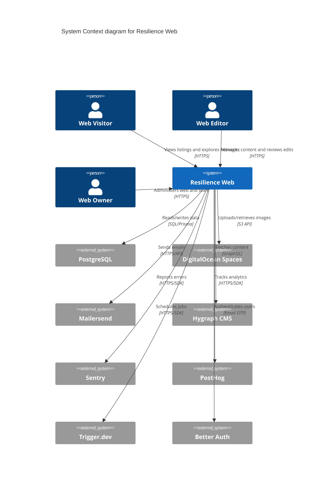

# Architecture Documentation

## Overview

Resilience Web is a multi-tenant Next.js 16 application that serves as an interactive directory platform for local environmental and social justice organizations. The platform enables communities to create their own "webs" - interactive digital maps showing relationships between organizations, initiatives, and resources within a specific geographic area.

Each web operates independently with its own subdomain, listings, categories, team members, and customizable content, while sharing the same underlying infrastructure.


## System Context Diagram (C4 Model - Level 1)



## High-Level Architecture

### Multi-Tenant Architecture

Resilience Web uses a **subdomain-based multi-tenancy** approach where each community ("web") operates on its own subdomain while sharing the same codebase and database:

- **Routing**: Next.js dynamic routing with `[subdomain]` folder structure
- **Data Isolation**: Each web's data is isolated via foreign key relationships to the `Web` model
- **Independent Configuration**: Each web has its own categories, tags, team members, and branding
- **Soft Deletes**: Webs use `deletedAt` timestamps for reversible deletion

### Application Layers

```
┌─────────────────────────────────────────────────────────┐
│                   Presentation Layer                     │
│  Next.js App Router + React Components + Tailwind CSS   │
│         (Shadcn/ui, Leaflet Maps, Vis-Network)          │
└─────────────────────────────────────────────────────────┘
                           ↓
┌─────────────────────────────────────────────────────────┐
│                    API Layer (REST)                      │
│    Next.js Route Handlers (/app/api/*) - 30s timeout   │
└─────────────────────────────────────────────────────────┘
                           ↓
┌─────────────────────────────────────────────────────────┐
│                   Business Logic Layer                   │
│    Repository Pattern (db/*) + Helper Functions         │
└─────────────────────────────────────────────────────────┘
                           ↓
┌─────────────────────────────────────────────────────────┐
│                    Data Access Layer                     │
│              Prisma ORM 7.2.0 + PostgreSQL 17           │
└─────────────────────────────────────────────────────────┘
```

## Technology Stack

### Core Framework
- **Next.js 16** (App Router, Turbopack)
- **React 19** (Server Components, Strict Mode disabled)
- **TypeScript** (with path aliases)

### Database & ORM
- **PostgreSQL 17** (via Docker for local dev)
- **Prisma 7.2.0** (ORM with custom client path)
  - Runtime client: `@prisma-rw`
  - Build-time client: `@prisma-rw-build`

### Authentication & Authorization
- **Better Auth v1.4.9** (Email OTP with 10-minute expiry)
- Role-based access control (OWNER, EDITOR roles via `WebAccess`)

### File Storage
- **DigitalOcean Spaces** (S3-compatible object storage)
- **Sharp** (server-side image optimization)
- **Next.js Image Component** (automatic optimization)

### Email
- **Production**: Mailersend (transactional emails)
- **Development**: Mailpit (local SMTP testing on port 8025)
- **Templates**: React Email components

### Background Jobs
- **Trigger.dev v4.1.2** (scheduled tasks)
  - Monitor inactive webs
  - Auto-unfeature expired listings

### UI & Visualization
- **Tailwind CSS 4** (styling)
- **Shadcn/ui** (component library built on Radix UI)
- **Leaflet** (interactive maps with marker clustering)
- **Vis-Network** (relationship graph visualization)
- **TinyMCE v8.3.1** (WYSIWYG rich text editor)

### CMS & Content
- **Hygraph** (GraphQL headless CMS for blog and static pages)
- **Remark** (Markdown processing)

### Monitoring & Analytics
- **Sentry** (error tracking and performance monitoring)
- **PostHog** (product analytics and feature flags)

### Developer Tools
- **ESLint** (linting with TypeScript, React, Next.js, a11y plugins)
- **Prettier** (code formatting with Tailwind class sorting)
- **Stylelint** (CSS linting)
- **Playwright** (E2E testing)

## Key Architectural Patterns

### 1. Repository Pattern

Data access logic is centralized in repository modules under `/db`:
- `webRepository.ts` - Web/organization queries
- `webAccessRepository.ts` - Team member access control
- `listingEditRepository.ts` - Listing edit workflow
- `permissionRepository.ts` - Legacy permissions

This separates database concerns from business logic and provides reusable data access functions.

### 2. Edit-and-Approve Workflow

Listings use a pending edit system for quality control:

1. User submits changes → `ListingEdit` record created
2. Web editors/owners review in dashboard
3. On approval → changes merged to `Listing` model
4. `ListingEdit.accepted = true` marks as completed

This prevents unauthorized or low-quality modifications while enabling community contributions.

### 3. Soft Delete Pattern

The `Web` model implements soft deletes:
- Records marked with `deletedAt` timestamp instead of physical deletion
- Queries filter: `WHERE deletedAt IS NULL`
- Enables recovery and maintains referential integrity

### 4. Static Generation with ISR

- Uses `generateStaticParams()` for pre-rendering web pages
- Incremental Static Regeneration (ISR) with `revalidate` config
- Dynamic rendering for authenticated routes
- Large page data compressed using base64 encoding to reduce payload

### 5. Client-Side State Management Strategy

- **Server State**: React Query (@tanstack/react-query) for API data caching
- **Global State**: React Context (`AppContext`) for app-wide state
- **URL State**: Nuqs for query string synchronization
- **Form State**: React Hook Form + Zod for validation

## Data Model Overview

### Core Entities

- **Web**: Organization/community with subdomain, location, team, settings
- **Listing**: Directory entry with description, location, images, social links
- **ListingEdit**: Pending edit proposals requiring approval
- **Category**: Per-web categorization with colors and Font Awesome icons
- **Tag**: Per-web tagging system for listings
- **User**: User accounts authenticated via email OTP
- **WebAccess**: Junction table for team member roles (OWNER, EDITOR)
- **Session**: Active user sessions with IP and user agent tracking

### Key Relationships

```
Web 1──* Listing
Web 1──* Category
Web 1──* Tag
Web 1──* WebAccess *──1 User
Listing *──* Category
Listing *──* Tag
Listing 1──* ListingEdit
Listing 1──1 ListingLocation
Listing 1──* ListingAction
Listing 1──* ListingSocialMedia
```

## Deployment Architecture

### Hosting
- **Platform**: Vercel (serverless)
- **Environments**: Production + Staging
- **Edge Functions**: Not currently used
- **Region**: Configured per Vercel settings

### CI/CD
- Automatic deployments on git push (production)
- Manual staging deployments via Vercel CLI

### Configuration
- API route timeout: 30 seconds (vercel.json)
- Build-time Prisma client generation
- Environment variables via Vercel dashboard or `.env` locally

## Security Considerations

- **Authentication**: Email OTP with time-limited codes (10 minutes)
- **Authorization**: Role-based access control per web
- **CSRF Protection**: Built into Better Auth
- **Input Validation**: Zod schemas for all form inputs
- **SQL Injection**: Protected via Prisma parameterized queries
- **XSS**: React automatic escaping + sanitized rich text from TinyMCE
- **Image Upload**: Server-side validation and Sharp processing
- **CORS**: Configured selectively (e.g., feedback API)

## Scalability Considerations

### Current Approach
- Multi-tenant shared database (cost-effective for small-medium scale)
- Serverless functions on Vercel (auto-scaling)
- CDN-backed static assets via DigitalOcean Spaces
- ISR for popular pages (reduces database load)

### Future Scaling Paths
- Database connection pooling (PgBouncer)
- Read replicas for analytics queries
- Redis for session storage and caching
- Edge functions for geographically distributed users
- Database partitioning by web if tenant count grows significantly

## References

- [Next.js Documentation](https://nextjs.org/docs)
- [Prisma Documentation](https://www.prisma.io/docs)
- [Better Auth Documentation](https://www.better-auth.com/docs)
- [C4 Model](https://c4model.com)
- [Project Blog Post](https://dinerismail.dev/blog/how-i-built-a-product-that-people-love)
