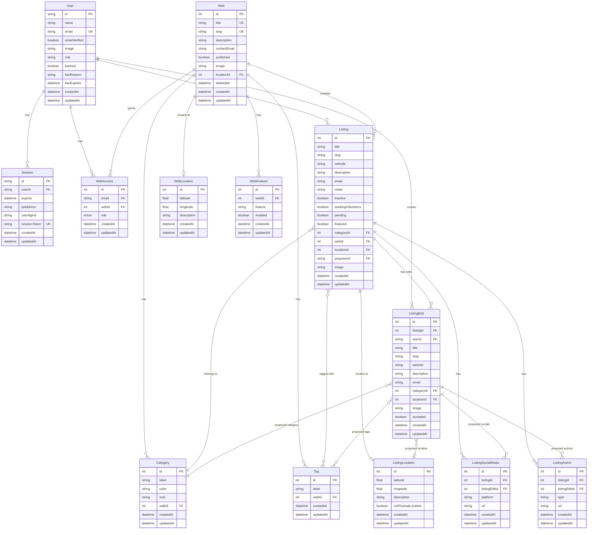

# Data Model

This document describes the core database schema for Resilience Web using an Entity-Relationship Diagram (ERD).

## Core Entity-Relationship Diagram

## Key Design Patterns

### Multi-Tenancy
Each `Web` represents an independent tenant with:
- Own subdomain (via `slug`)
- Own listings, categories, and tags
- Own team members (via `WebAccess`)
- Soft delete support (via `deletedAt`)

### Access Control
- **WebAccess**: Junction table linking Users to Webs with role-based permissions
  - `OWNER`: Full administrative access
  - `EDITOR`: Content management access
- Each import/edit operation checks user's role for the target web

### Edit Approval Workflow
- Users propose changes via `ListingEdit` records
- Editors/Owners review and approve edits
- On approval, changes merge to `Listing` and `accepted = true`
- Related data (location, socials, actions) handled through foreign keys

### Soft Deletes
- `Web.deletedAt`: Nullable timestamp for reversible deletion
- Queries filter `WHERE deletedAt IS NULL`
- Maintains referential integrity

### Location Data
- **ListingLocation**: Geocoded coordinates for individual listings
- **WebLocation**: Geographic center for web/community
- Both support latitude/longitude and text description

## Entity Tables

### User

Represents authenticated users in the system.

| Field | Type | Constraints | Description | Schema.org Mapping |
|-------|------|-------------|-------------|--------------------|
| id | String (CUID) | PK | Unique identifier | - |
| name | String | - | User's display name | schema.org/Person → name |
| email | String | UK | User's email address | schema.org/Person → email |
| emailVerified | Boolean | - | Email verification status | - |
| image | String | - | Profile picture URL | schema.org/Person → image |
| role | String | - | Global role (for admin features) | - |
| banned | Boolean | - | Whether user is banned | - |
| banReason | String | - | Reason for ban | - |
| banExpires | DateTime | Nullable | Ban expiration timestamp | - |
| createdAt | DateTime | Auto | Account creation timestamp | - |
| updatedAt | DateTime | Auto | Last update timestamp | - |

**Schema.org Type**: [Person](https://schema.org/Person)

---

### Session

Manages user authentication sessions.

| Field | Type | Constraints | Description | Schema.org Mapping |
|-------|------|-------------|-------------|--------------------|
| id | String (CUID) | PK | Unique identifier | - |
| userId | String | FK → User | Associated user | - |
| expires | DateTime | - | Session expiration | - |
| ipAddress | String | - | Client IP address | - |
| userAgent | String | - | Client user agent | - |
| sessionToken | String | UK | Unique session token | - |
| createdAt | DateTime | Auto | Session creation timestamp | - |
| updatedAt | DateTime | Auto | Last update timestamp | - |

**Schema.org Type**: N/A (Internal)

---

### Web

Represents a community web/subdomain (multi-tenant entity).

| Field | Type | Constraints | Description | Schema.org Mapping |
|-------|------|-------------|-------------|--------------------|
| id | Integer | PK | Unique identifier | - |
| title | String | UK | Web name/title | schema.org/WebSite → name |
| slug | String | UK | URL-safe identifier (subdomain) | schema.org/WebSite → identifier |
| description | String | - | Web description | schema.org/WebSite → description |
| contactEmail | String | - | Contact email for the web | schema.org/WebSite → publisher → email |
| published | Boolean | - | Whether web is publicly visible | - |
| image | String | - | Web logo/image URL | schema.org/WebSite → image |
| locationId | Integer | FK → WebLocation, Nullable | Geographic area served | schema.org/WebSite → spatialCoverage |
| deletedAt | DateTime | Nullable | Soft delete timestamp | - |
| createdAt | DateTime | Auto | Creation timestamp | - |
| updatedAt | DateTime | Auto | Last update timestamp | - |

**Schema.org Type**: [WebSite](https://schema.org/WebSite)

---

### WebLocation

Geographic area covered by a Web (used for spatialCoverage).

| Field | Type | Constraints | Description | Schema.org Mapping |
|-------|------|-------------|-------------|--------------------|
| id | Integer | PK | Unique identifier | - |
| latitude | Float | - | Latitude coordinate | schema.org/Place → geo → latitude |
| longitude | Float | - | Longitude coordinate | schema.org/Place → geo → longitude |
| description | String | - | Human-readable place name | schema.org/Place → name or address |
| createdAt | DateTime | Auto | Creation timestamp | - |
| updatedAt | DateTime | Auto | Last update timestamp | - |

**Schema.org Type**: [Place](https://schema.org/Place) with [GeoCoordinates](https://schema.org/GeoCoordinates)

---

### WebAccess

Junction table for user permissions on Webs.

| Field | Type | Constraints | Description | Schema.org Mapping |
|-------|------|-------------|-------------|--------------------|
| id | Integer | PK | Unique identifier | - |
| email | String | FK → User, Composite UK | User's email | - |
| webId | Integer | FK → Web, Composite UK | Associated web | - |
| role | Enum | `OWNER`, `EDITOR` | Permission role | schema.org/OrganizationRole → roleName |
| createdAt | DateTime | Auto | Creation timestamp | - |
| updatedAt | DateTime | Auto | Last update timestamp | - |

**Schema.org Type**: [OrganizationRole](https://schema.org/OrganizationRole)

---

### WebFeature

Feature flags for Webs (e.g., enable/disable import).

| Field | Type | Constraints | Description | Schema.org Mapping |
|-------|------|-------------|-------------|--------------------|
| id | Integer | PK | Unique identifier | - |
| webId | Integer | FK → Web | Associated web | - |
| feature | String | - | Feature name/key | - |
| enabled | Boolean | - | Whether feature is enabled | - |
| createdAt | DateTime | Auto | Creation timestamp | - |
| updatedAt | DateTime | Auto | Last update timestamp | - |

**Schema.org Type**: N/A (Internal)

---

### Category

Taxonomy categories for Listings within a Web.

| Field | Type | Constraints | Description | Schema.org Mapping |
|-------|------|-------------|-------------|--------------------|
| id | Integer | PK | Unique identifier | - |
| label | String | Composite UK (webId, label) | Category name | schema.org/DefinedTerm → name |
| color | String | - | Display color (hex) | - |
| icon | String | - | Icon identifier | - |
| webId | Integer | FK → Web | Associated web | schema.org/DefinedTerm → inDefinedTermSet |
| createdAt | DateTime | Auto | Creation timestamp | - |
| updatedAt | DateTime | Auto | Last update timestamp | - |

**Schema.org Type**: [DefinedTerm](https://schema.org/DefinedTerm)

---

### Tag

Folksonomy tags for Listings within a Web.

| Field | Type | Constraints | Description | Schema.org Mapping |
|-------|------|-------------|-------------|--------------------|
| id | Integer | PK | Unique identifier | - |
| label | String | Composite UK (webId, label) | Tag name | schema.org/DefinedTerm → name |
| webId | Integer | FK → Web | Associated web | schema.org/DefinedTerm → inDefinedTermSet |
| createdAt | DateTime | Auto | Creation timestamp | - |
| updatedAt | DateTime | Auto | Last update timestamp | - |

**Schema.org Type**: [DefinedTerm](https://schema.org/DefinedTerm)

---

### Listing

Core entity representing organizations/businesses in a Web.

| Field | Type | Constraints | Description | Schema.org Mapping |
|-------|------|-------------|-------------|--------------------|
| id | Integer | PK | Unique identifier | - |
| title | String | - | Organization name | schema.org/Organization → name |
| slug | String | Composite UK (webId, slug) | URL-safe identifier | schema.org/Organization → identifier |
| website | String | - | Organization website URL | schema.org/Organization → url |
| description | String | - | Organization description | schema.org/Organization → description |
| email | String | - | Contact email | schema.org/Organization → email |
| notes | String | - | Internal notes | - |
| inactive | Boolean | - | Whether organization is inactive | - |
| seekingVolunteers | Boolean | - | Whether seeking volunteers | schema.org/Organization → seeks (VolunteerOpportunity) |
| pending | Boolean | - | Awaiting approval | - |
| featured | Boolean | - | Featured on homepage | - |
| categoryId | Integer | FK → Category | Primary category | schema.org/Organization → category |
| webId | Integer | FK → Web | Associated web directory | - |
| locationId | Integer | FK → ListingLocation, Nullable | Geographic location | schema.org/Organization → location |
| proposerId | String | FK → User, Nullable | User who proposed listing | - |
| image | String | - | Logo/image URL | schema.org/Organization → logo |
| createdAt | DateTime | Auto | Creation timestamp | - |
| updatedAt | DateTime | Auto | Last update timestamp | - |

**Schema.org Type**: [Organization](https://schema.org/Organization) or [LocalBusiness](https://schema.org/LocalBusiness)

---

### ListingLocation

Geographic coordinates for a Listing.

| Field | Type | Constraints | Description | Schema.org Mapping |
|-------|------|-------------|-------------|--------------------|
| id | Integer | PK | Unique identifier | - |
| latitude | Float | - | Latitude coordinate | schema.org/GeoCoordinates → latitude |
| longitude | Float | - | Longitude coordinate | schema.org/GeoCoordinates → longitude |
| description | String | - | Human-readable address | schema.org/PostalAddress → streetAddress or schema.org/Place → address |
| noPhysicalLocation | Boolean | - | Virtual/online only | - |
| createdAt | DateTime | Auto | Creation timestamp | - |
| updatedAt | DateTime | Auto | Last update timestamp | - |

**Schema.org Type**: [GeoCoordinates](https://schema.org/GeoCoordinates) + [Place](https://schema.org/Place)

---

### ListingSocialMedia

Social media profiles for a Listing.

| Field | Type | Constraints | Description | Schema.org Mapping |
|-------|------|-------------|-------------|--------------------|
| id | Integer | PK | Unique identifier | - |
| listingId | Integer | FK → Listing, Nullable | Associated listing (if published) | - |
| listingEditId | Integer | FK → ListingEdit, Nullable | Associated edit (if pending) | - |
| platform | String | - | Social platform name | schema.org/ContactPoint → contactType |
| url | String | - | Profile URL | schema.org/ContactPoint → url or schema.org/Organization → sameAs |
| createdAt | DateTime | Auto | Creation timestamp | - |
| updatedAt | DateTime | Auto | Last update timestamp | - |

**Schema.org Type**: [ContactPoint](https://schema.org/ContactPoint) or use `sameAs` property

---

### ListingAction

Call-to-action links for a Listing (e.g., donate, volunteer).

| Field | Type | Constraints | Description | Schema.org Mapping |
|-------|------|-------------|-------------|--------------------|
| id | Integer | PK | Unique identifier | - |
| listingId | Integer | FK → Listing, Nullable | Associated listing (if published) | - |
| listingEditId | Integer | FK → ListingEdit, Nullable | Associated edit (if pending) | - |
| type | String | - | Action type (donate, volunteer, etc.) | schema.org/Action → potentialAction → @type |
| url | String | - | Action URL | schema.org/Action → potentialAction → target |
| createdAt | DateTime | Auto | Creation timestamp | - |
| updatedAt | DateTime | Auto | Last update timestamp | - |

**Schema.org Type**: [Action](https://schema.org/Action) (as `potentialAction` on Organization)

---

### ListingEdit

Proposed changes to a Listing (edit approval workflow).

| Field | Type | Constraints | Description | Schema.org Mapping |
|-------|------|-------------|-------------|--------------------|
| id | Integer | PK | Unique identifier | - |
| listingId | Integer | FK → Listing | Listing being edited | - |
| userId | String | FK → User | User proposing changes | - |
| title | String | - | Proposed title | - |
| slug | String | - | Proposed slug | - |
| website | String | - | Proposed website | - |
| description | String | - | Proposed description | - |
| email | String | - | Proposed email | - |
| categoryId | Integer | FK → Category, Nullable | Proposed category | - |
| locationId | Integer | FK → ListingLocation, Nullable | Proposed location | - |
| image | String | - | Proposed image | - |
| accepted | Boolean | - | Whether edit was approved | - |
| createdAt | DateTime | Auto | Creation timestamp | - |
| updatedAt | DateTime | Auto | Last update timestamp | - |

---

## Field Types & Constraints

### Primary Keys
- `User.id`, `Session.id`: String (CUID)
- All other tables: Integer auto-increment

### Unique Constraints
- `User.email`
- `Web.title`, `Web.slug`
- `Category`: Composite `(webId, label)`
- `Tag`: Composite `(webId, label)`
- `Listing`: Composite `(webId, slug)`
- `WebAccess`: Composite `(email, webId)`

### Enums
- `WebRole`: `OWNER`, `EDITOR`

## Timestamps
All models include:
- `createdAt`: Auto-set on creation
- `updatedAt`: Auto-updated on modification

## Schema.org Mapping Summary

The application's data model closely aligns with schema.org vocabularies for semantic web compatibility:

- **Listing** → [Organization](https://schema.org/Organization) / [LocalBusiness](https://schema.org/LocalBusiness)
- **Web** → [WebSite](https://schema.org/WebSite)
- **User** → [Person](https://schema.org/Person)
- **WebLocation** → [Place](https://schema.org/Place) with [GeoCoordinates](https://schema.org/GeoCoordinates) (for spatialCoverage)
- **ListingLocation** → [GeoCoordinates](https://schema.org/GeoCoordinates) + [Place](https://schema.org/Place)
- **Category** / **Tag** → [DefinedTerm](https://schema.org/DefinedTerm)
- **ListingSocialMedia** → [ContactPoint](https://schema.org/ContactPoint) or `sameAs` property
- **ListingAction** → [Action](https://schema.org/Action) (as `potentialAction`)
- **ListingEdit** → [UpdateAction](https://schema.org/UpdateAction)
- **WebAccess** → [OrganizationRole](https://schema.org/OrganizationRole)

This mapping enables:
- **SEO optimization** through structured data in HTML (`<script type="application/ld+json">`)
- **Data portability** via standard vocabularies
- **API interoperability** with other schema.org-aware systems

## Related Documentation
- [Architecture Overview](../architecture.md)
- [API Routes](../../AGENTS.md#api-routes)
- [Repository Pattern](../architecture.md#1-repository-pattern)
